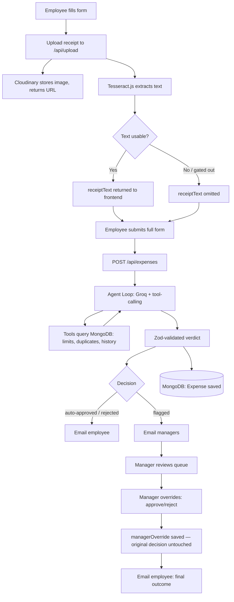

# Smart Expense Approver

An agentic AI expense-approval system. Employees submit expenses with an optional receipt; an AI agent reasons over live company data using tool-calling to auto-approve, flag, or reject each submission — writing a plain-language justification that becomes the audit trail. Managers review flagged expenses and can override the agent's verdict, with both the AI's original reasoning and the human's final call preserved side by side.

This is deliberately **not** a RAG/vector-search project (that's a separate piece of work). The goal here is to demonstrate a different skill: an agent that reasons over tools and structured data to make a real decision, rather than retrieving and summarizing documents.

---

## Table of Contents

- [The Core Idea](#the-core-idea)
- [Tech Stack](#tech-stack)
- [Architecture Overview](#architecture-overview)
- [Database Design](#database-design)
- [The Agent Loop, In Detail](#the-agent-loop-in-detail)
- [Receipt Upload & OCR Pipeline](#receipt-upload--ocr-pipeline)
- [Human-in-the-Loop: Manager Override](#human-in-the-loop-manager-override)
- [Security Model](#security-model)
- [API Reference](#api-reference)
- [Architecture Decisions — Q&A](#architecture-decisions--qa)
- [Known Limitations](#known-limitations)
- [Local Setup](#local-setup)

---

## The Core Idea

> The AI isn't just generating text — it's making a decision and taking an action based on its own reasoning, not a decision I hardcoded. I give the model a goal and a set of tools; I don't tell it which checks to run or in what order. It decides, calls them, reads real results from the database, and produces a structured verdict that gets written back and drives real downstream behavior — emails, a manager queue, an audit trail.

The system prompt tells the agent **what each decision bucket is for** (what "flagged" means, what "rejected" means), never **when** to use it for a specific case. All spending limits, receipt thresholds, and history are looked up live via tool calls against MongoDB — nothing is hardcoded into the prompt as a fact, only as a framework for judgment.

---

## Tech Stack

| Layer | Technology |
|---|---|
| Backend | Express + TypeScript (Node, ESM) |
| Database | MongoDB + Mongoose |
| Auth | Clerk (`@clerk/express`, `@clerk/clerk-react`), role via custom session claim |
| Agent / LLM | Groq API, `openai/gpt-oss-120b` |
| Validation | Zod (tool args, verdict schema) |
| File storage | Cloudinary |
| OCR | Tesseract.js |
| File upload | multer (memory storage) |
| Email | Nodemailer (Gmail SMTP) |
| Frontend | React + Vite + TypeScript + Tailwind CSS |

---

## Architecture Overview



Two architectural principles run through the whole system:

1. **The agent proposes, trusted code disposes.** Every tool the LLM can call is **read-only**. The model never writes to the database directly — it produces a verdict, that verdict is Zod-validated, and only then does backend code persist it.
2. **Nothing is silently overwritten.** A manager override never replaces the agent's original `decision` — it's stored in a separate `managerOverride` subfield, so the full history (what the AI decided, what the human decided) is always reconstructable.

---

## Database Design

### `Expense` collection

| Field | Type | Notes |
|---|---|---|
| `userId` | `string` | Clerk user ID of the submitter |
| `amount` | `number` | Claimed amount — the figure policy is checked against |
| `category` | `string` | Meals / Travel / Equipment / Software / Other |
| `description` | `string` | Free text |
| `hasReceipt` | `boolean` | **Server-derived only** — `!!receiptUrl`, never accepted from the client |
| `receiptUrl` | `string?` | Cloudinary URL, set only via `/api/upload` at submit time |
| `receiptText` | `string?` | OCR output, gated by a usability check; independent evidence, not the source of truth for amount |
| `date` | `Date` | Expense date |
| `decision` | `enum` | `pending` \| `auto-approved` \| `flagged` \| `rejected` — the agent's original verdict, **immutable after override** |
| `reasoning` | `string?` | Agent's written justification |
| `confidence` | `number?` | 0–1, agent's self-reported confidence |
| `flaggedRules` | `string[]?` | Structured tags, e.g. `"Receipt amount mismatch"` |
| `managerOverride` | `object?` | `{ decision: "approved" \| "rejected", overriddenBy, overriddenAt }` — separate from `decision` |
| `createdAt` | `Date` | |

**Gotcha worth documenting:** `managerOverride` as a nested plain object is auto-initialized to `{}` by Mongoose, so it's never truly `undefined`. Every "has this been overridden" check must test `expense.managerOverride?.decision` specifically, not just the object's presence.

### `ExpenseRule` collection

| Field | Type | Notes |
|---|---|---|
| `category` | `string` | Unique |
| `spendingLimit` | `number` | Looked up live by the `checkSpendingLimit` tool |
| `receiptThreshold` | `number` | Looked up live by the `checkReceiptRequired` tool |

Rules are stored in the database, not the codebase — an admin can change policy without a deploy (an admin UI for this is on the roadmap; currently edited directly in Mongo).

---

## The Agent Loop, In Detail

### Tools (all read-only)

| Tool | Purpose |
|---|---|
| `checkSpendingLimit(category, amount)` | Looks up the live category limit from `ExpenseRule` |
| `checkReceiptRequired(amount, hasReceipt)` | Checks whether a receipt was needed and was provided |
| `checkDuplicateSubmission(userId, amount, date)` | Searches for a matching amount from the same user within a ±3-day window |
| `viewPurchaseHistory(userId)` | Returns the user's last 10 expenses and their flag rate — a trust signal |

The model decides **which** of these to call, in what order, and whether to call any of them more than once — nothing is forced.

### Multi-round tool-calling

The loop is not single-shot. It runs in a `while` loop (capped at `MAX_TOOL_ROUNDS = 4` as a safety valve) that keeps offering tools until the model returns a response with no further `tool_calls`, at which point it's forced into a final, tools-free JSON-only turn to produce the verdict.

### Verdict extraction

```ts
const verdictSchema = z.object({
  decision: z.enum(["auto-approved", "flagged", "rejected"]),
  confidence: z.number().min(0).max(1),
  reasoning: z.string(),
  flaggedRules: z.array(z.string()).optional(),
});
```

`response_format: { type: "json_object" }` plus `temperature: 0.1` push toward consistent, parseable output. If the model still returns invalid JSON or fails schema validation, it gets up to 2 retries with the specific Zod error fed back to it. If all retries fail, the system **fails toward human review** — `flagged`, `confidence: 0`, rather than crashing or silently dropping the expense.

### Prompt structure: claim vs. evidence

The user message explicitly separates the employee's **claimed amount** (the figure to check policy against) from the **receipt text** (independent evidence to verify the claim against, never a substitute source of truth):

```
Claimed amount: $75
Category: Meals
...
Extracted receipt text (independent evidence, verify against the claim
above, do not treat as the claimed amount):
PC Hotel INVOICE ... Total $40.00
```

This separation exists because of a real bug found in testing (see Q&A below) — without it, the model would occasionally pull the receipt's figure into a tool call in place of the claimed amount, silently defeating the fraud check it was supposed to be performing.

---

## Receipt Upload & OCR Pipeline

Deliberately decoupled from expense submission:

1. `POST /api/upload` — a standalone, stateless route. Takes a file (multer, memory storage, 5MB cap, image/PDF mimetypes only), uploads it to Cloudinary, runs Tesseract.js OCR, and returns `{ receiptUrl, receiptText }`. Nothing is written to MongoDB here — there's no `Expense` document yet.
2. A lightweight **usability gate** filters OCR noise before it ever reaches the agent:
   ```ts
   function isReceiptTextUsable(text: string): boolean {
     const cleaned = text.trim();
     if (cleaned.length < 10) return false;
     const alphanumericRatio =
       (cleaned.match(/[a-zA-Z0-9]/g)?.length ?? 0) / cleaned.length;
     return alphanumericRatio > 0.3;
   }
   ```
   This is intentionally a **data-quality filter only** — it decides whether text is legible enough to hand to the agent, never what the agent should conclude from it. Regex is not used to extract structured fields (amount, date, vendor) from the receipt; that's left to the LLM's free-text reasoning, since receipt layouts vary too much for pattern matching to be robust.
3. The frontend holds `receiptUrl`/`receiptText` in form state and includes them as plain JSON fields when the user eventually submits the full expense — `submitExpense` never becomes a `multipart/form-data` request.

---

## Human-in-the-Loop: Manager Override

- `GET /api/expenses/flagged` — manager-only, returns all expenses with `decision: "flagged"`.
- `PATCH /api/expenses/:id/override` — manager-only, sets `managerOverride`, **never** touches `decision`.
- The frontend's manager queue additionally filters out expenses that already have a `managerOverride.decision` set — a display concern (the queue should show *pending* reviews), not a data-model concern (the backend's flagged-list endpoint correctly still includes them for audit purposes).
- On the employee side, the UI computes an **effective status** for display: if `managerOverride.decision` exists, show that (e.g. "approved (manager)"); otherwise show the agent's original `decision`. The stored data never changes — only what's displayed.

---

## Security Model

- **Read-only tools, trusted writes.** The LLM can query but never mutate state. Every DB write happens in controller code, after Zod validation of the verdict.
- **`hasReceipt` is never client-controlled.** It's computed server-side (`!!receiptUrl`) at submit time; any `hasReceipt` field sent by the client is explicitly stripped and ignored.
- **Receipts are immutable after submission.** `PATCH /api/expenses/:id` (employee edit) does not accept `receiptUrl` or `receiptText` at all — an employee cannot swap in a fabricated receipt URL post-submission. Changing a receipt requires deleting and resubmitting.
- **Role-gating via Clerk session claims**, checked on every manager-only route — `403` if the authenticated user isn't a manager, `401` if not authenticated at all (these two are used precisely: 401 means "we don't know who you are," 403 means "we know, and you're not allowed").
- **Edit/delete windows are enforced server-side**, not just hidden in the UI — only `pending`/`flagged` expenses with no `managerOverride.decision` can be modified or removed, checked independently on every request regardless of what the frontend shows.

---

## API Reference

All routes are prefixed with `/api`. Authenticated routes require `Authorization: Bearer <Clerk session token>`.

### `POST /api/upload`

Uploads a receipt file, returns Cloudinary URL + OCR text. Does not touch the database.

- **Auth:** required
- **Body:** `multipart/form-data`, field name `receipt` (image/jpeg, image/png, image/webp, or application/pdf, max 5MB)
- **Response `200`:**
  ```json
  { "receiptUrl": "https://res.cloudinary.com/...", "receiptText": "..." }
  ```
  `receiptText` is omitted if OCR output fails the usability gate.

### `POST /api/expenses`

Submits a new expense. Runs the full agent loop synchronously before responding.

- **Auth:** required
- **Body:**
  ```json
  {
    "amount": 75,
    "category": "Meals",
    "description": "Team dinner",
    "date": "2026-08-18",
    "receiptUrl": "https://...",
    "receiptText": "..."
  }
  ```
- **Response `201`:** the saved `Expense` document, including `decision`, `reasoning`, `confidence`, `flaggedRules`.

### `GET /api/expenses`

Returns the authenticated user's own expenses, most recent first.

- **Auth:** required
- **Response `200`:** `Expense[]`

### `GET /api/expenses/flagged`

Returns all expenses currently in `flagged` state, across all users.

- **Auth:** required, manager role only
- **Response `200`:** `Expense[]` — `403` if not a manager

### `PATCH /api/expenses/:id/override`

Manager decision on a flagged expense.

- **Auth:** required, manager role only
- **Body:** `{ "decision": "approved" | "rejected" }`
- **Response `200`:** the updated `Expense`, with `managerOverride` populated. `decision` is unchanged.

### `PATCH /api/expenses/:id`

Employee edit of their own expense. Re-runs the agent on the updated data.

- **Auth:** required, must be the owner, expense must be `pending`/`flagged` and not overridden
- **Body:** any of `{ amount, category, description, date }` — receipt fields are not accepted
- **Response `200`:** the updated `Expense` with a freshly re-evaluated `decision`/`reasoning`

### `DELETE /api/expenses/:id`

Deletes an editable expense.

- **Auth:** required, must be the owner, expense must be `pending`/`flagged` and not overridden
- **Response `200`:** `{ "message": "Expense deleted successfully", "id": "..." }`

---

## Architecture Decisions — Q&A

**Why not use LangChain?**
At this project's scope — single-turn evaluation, four tools — a framework's abstractions would add indirection without adding capability. The tool-calling loop is hand-built directly against the Groq API, which keeps every step (message construction, tool dispatch, retry logic) fully visible and explainable.

**Why `temperature: 0.1`?**
This is a classification/decision task, not a creative one. Low temperature makes format-following and consistency far more reliable across repeated runs of similar cases.

**Why retry-with-a-human-fallback instead of just trusting the first response?**
LLM output is unreliable-by-default even with `response_format: json_object`. Failing toward human review (`flagged`, `confidence: 0`) rather than crashing or silently dropping the expense is the safer failure mode — the system degrades to "ask a person" rather than failing invisibly.

**Why is the tool-calling loop multi-round, not single-shot?**
It wasn't originally — the first version called tools once, then forced a final answer. Migrating from `llama-3.3-70b-versatile` (deprecated by Groq mid-project) to `openai/gpt-oss-120b` surfaced a real gap: the new model would sometimes want to call a tool *again* after seeing the first round of results, and a single-round loop couldn't accommodate that, throwing `tool_use_failed`. The fix — loop until the model stops calling tools on its own — is actually a more honest implementation of the project's core claim: the model decides when it has enough evidence, not the code.

**Why are tools read-only?**
A clean, defensible security boundary: the agent proposes, trusted backend code (after Zod validation) disposes. The LLM can never directly cause a database write.

**Why judgment criteria in the system prompt, not hardcoded if/else thresholds?**
Dictating exact conditions for flag/reject would defeat the purpose of an *agentic* system — the model needs room to weigh evidence itself. The prompt describes what each decision bucket is *for*, not when to use it for a specific case.

**Why feed the agent `receiptText` but never `receiptUrl`?**
The agent is a text model with no vision capability — a URL is dead weight it can't act on. `receiptUrl` is stored on the `Expense` document purely for humans (managers clicking through to view the image); it never enters the agent's prompt.

**Why separate "claimed amount" from "receipt text" explicitly in the prompt, instead of one flat JSON object?**
Testing surfaced a real bug: with both values as sibling fields in a flat object, the model would sometimes call `checkSpendingLimit` with the receipt's figure instead of the employee's claimed figure — not comparing the two, but *conflating* them. Restructuring the prompt to make the claimed amount the clearly-labeled ground truth, and the receipt text explicitly labeled as evidence to verify against it, fixed this. It's a good example of a failure that looked like "the model can't read receipts" but was actually "the prompt gave two numbers no signal about which one to trust."

**Why regex only as a usability gate, never for extracting amounts/dates from receipts?**
Receipt layouts vary too much (multiple dollar figures per receipt — subtotal, tax, tip, total; inconsistent currency formatting; OCR character substitution) for regex-based field extraction to be robust. That's exactly the kind of fuzzy, unstructured task the LLM is already being used for elsewhere in this system — letting it reason freely over raw OCR text is both simpler to build and more robust than a bespoke parser.

**Why is the receipt immutable after submission — no re-upload on edit?**
If `PATCH /api/expenses/:id` accepted a new `receiptUrl`/`receiptText` as plain strings, an employee could fabricate a receipt with zero verification, completely bypassing Cloudinary/Tesseract. Since edit re-runs the agent, allowing a receipt swap without re-running real OCR would let a user retroactively "fix" a mismatch that was correctly caught the first time.

**Why Nodemailer/Gmail instead of Resend?**
Resend's free/test tier only allows sending to the account owner's own email without a verified domain — a real blocker for testing multi-user flows (employee + manager, different inboxes). Gmail SMTP has no such restriction, at the cost of not being a "real" transactional email service (500/day limit) — an acceptable trade-off for a portfolio project, and a fair "why not X in production" answer if asked.

**Why is `managerOverride` a separate field instead of overwriting `decision`?**
Preserves a full audit trail — you can always see both what the agent originally decided and what a human ultimately decided, rather than losing the AI's verdict the moment a human acts on it.

**Why 401 vs. 403, specifically?**
401 = "we don't know who you are" (not authenticated). 403 = "we know who you are, and you're not allowed to do this" (wrong role). Used consistently across every manager-gated route.

**Why no React Router for the manager/employee split?**
Two roles, two views, no need for deep-linkable URLs at this scope. Role is read from the Clerk session and rendered conditionally at the top level — introducing a router is the right move if shareable/bookmarkable routes become a real requirement, not before.

**Why reuse `ExpenseForm` for editing instead of a separate edit component or a modal?**
A dedicated edit-only form would be near-duplicate code with a different submit handler. `ExpenseForm` takes an optional `existingExpense` prop — its presence switches the component between create mode (calls `submitExpense`, shows the receipt uploader) and edit mode (calls `updateExpense`, shows the existing receipt as a read-only link, no re-upload). Rendered inline in the expense list rather than a modal, to avoid overlay/portal complexity for a UI this simple.

---

## Known Limitations

- Category spending limits are only editable directly in MongoDB — no admin UI yet.
- Manager queue shows the raw Clerk `userId` rather than a resolved name/email; would need a backend lookup endpoint to display something human-readable.
- Receipt OCR is a legibility gate, not a receipt-authenticity check — a clear, readable image of *anything* (not necessarily a real receipt) will pass the usability filter and be handed to the agent, which is relied upon to notice content that doesn't look like a genuine receipt.
- No automated test suite — verification so far has been manual, scenario-based testing against the live agent (documented via the reasoning traces this README's Q&A section draws from).

---

## Local Setup

### Backend

```bash
cd backend
npm install
cp .env.example .env   # fill in GROQ_API_KEY, MONGODB_URI, CLERK_SECRET_KEY,
                        # GMAIL_USER, GMAIL_APP_PASSWORD, CLOUDINARY_* vars
npm run dev
```

### Frontend

```bash
cd frontend
npm install
cp .env.example .env   # fill in VITE_CLERK_PUBLISHABLE_KEY
npm run dev
```

Manager access is granted manually via the Clerk dashboard: set a user's public metadata to `{"role": "manager"}`, and ensure the custom session token template exposes it (this project reads it as `sessionClaims.publicMetadata.role`).
